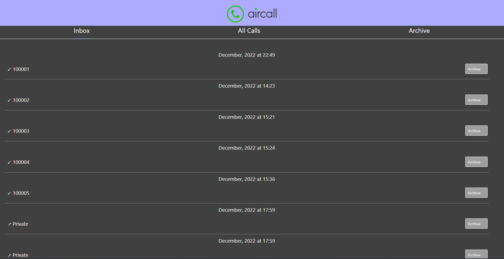
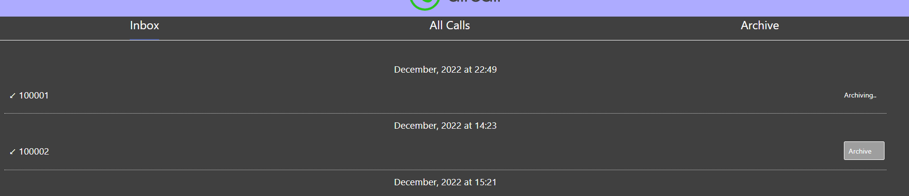
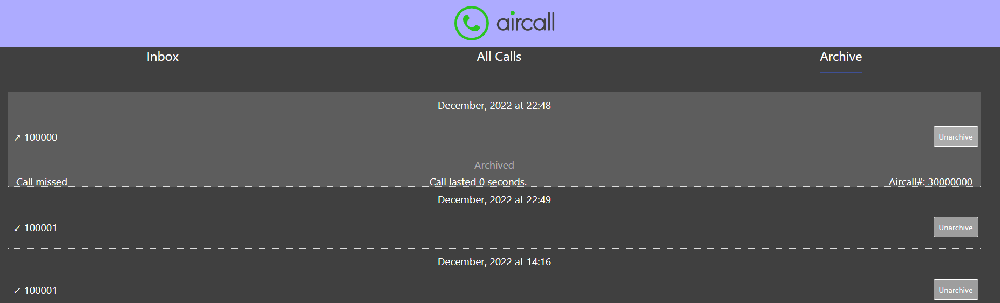

# Aircall Demo

This project's boilerplate was created with [Create React App](https://github.com/facebook/create-react-app) and [Speer's Aircall Boilerplate](https://github.com/speer-technologies/aircall).

## Getting Started

I used `npm` here, you would have to configure it for `yarn`.

Install dependencies with `npm install` 
Start the server wtih `npm start`

You are done, the build command is used for deployment.

## Available Scripts

### `npm start`

This will start the server and allow you to start interacting with the API right away using this front end react server.

### `npm run build` 

This will create a deployment version of the app.

### Other standard react dev commands are also available

## Sample pictures

### Activity feed

### While archiving a call

### Detailed view of a call

